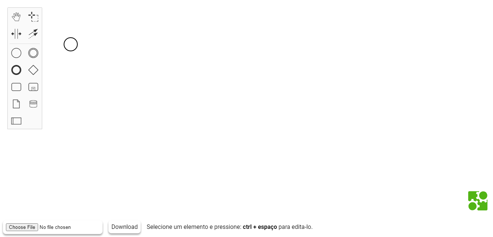
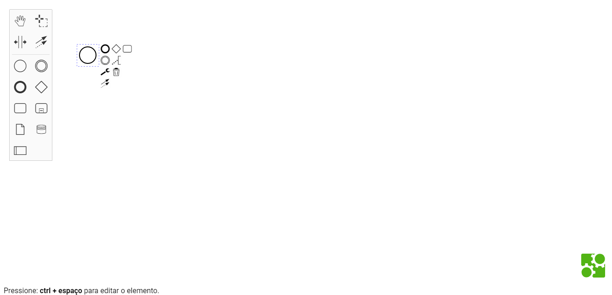
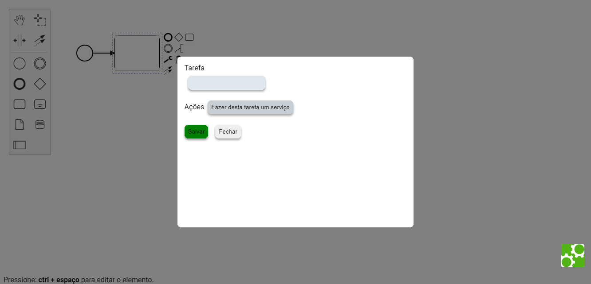

# React Properties Panel for bpmn-js

This example demonstrates a custom properties panel for [bpmn-js](https://github.com/bpmn-io/bpmn-js) written in [React](https://reactjs.org/).





## About

The component [`PropertiesView`](https://github.com/bpmn-io/bpmn-js-example-react-properties-panel/blob/master/app/properties-panel/PropertiesView.js) implements the properties panel. 

The component is mounted via standard React utilities and receives the BPMN modeler instance as props:

```js
ReactDOM.render(
  <PropertiesView modeler={ modeler } />,
  container
);
```

As part of its life-cycle hooks it hooks up with bpmn-js change and selection events to react to editor changes:

```js
class PropertiesView extends React.Component {

  ...
  
  componentDidMount() {
  
    const {
       modeler
    } = this.props;
    
    modeler.on('selection.changed', (e) => {
      this.setElement(e.newSelection[0]);
    });

    modeler.on('element.changed', (e) => {
      this.setElement(e.element);
    });
  }

}
```

Rendering the component we may display element properties and apply changes:

```js
class PropertiesView extends React.Component {
  
  ...
  
  render() {
  
    const {
      element
    } = this.state;
    
    return (
      <div>
        <fieldset>
          <label>id</label>
          <span>{ element.id }</span>
        </fieldset>

        <fieldset>
          <label>name</label>
          <input value={ element.businessObject.name || '' } onChange={ (event) => {
            this.updateName(event.target.value);
          } } />
        </fieldset>
      </div>
    );
  }
  
  updateName(newName) {
  
    const {
      element
    } = this.state;
    
    const { 
      modeler
    } = this.props;
    
    const modeling = modeler.get('modeling');
    
    modeling.updateLabel(element, newName);
  }
}
```


## Run the Example

```sh
npm install
npm start
```


## License

MIT


# Dev Notes

- 0.1
Update this function saveXML() on node_modules\bpmn-js\lib\Viewer.js
With return and done function, as the same we have here, if you want to export the xml.
/**
 * Export the currently displayed BPMN 2.0 diagram as
 * a BPMN 2.0 XML document.
 *
 * ## Life-Cycle Events
 *
 * During XML saving the viewer will fire life-cycle events:
 *
 *   * saveXML.start (before serialization)
 *   * saveXML.serialized (after xml generation)
 *   * saveXML.done (everything done)
 *
 * You can use these events to hook into the life-cycle.
 *
 * @param {Object} [options] export options
 * @param {Boolean} [options.format=false] output formated XML
 * @param {Boolean} [options.preamble=true] output preamble
 *
 * @param {Function} done invoked with (err, xml)
 */
Viewer.prototype.saveXML = function(options, done) {

  // Correção para "Fatal Error: done is not a functions".
  done = done || function() {};

  if (!done) {
    done = options;
    options = {};
  }

  var self = this;

  var definitions = this._definitions;

  if (!definitions) {
    return done(new Error('no definitions loaded'));
  }

  // allow to fiddle around with definitions
  definitions = this._emit('saveXML.start', {
    definitions: definitions
  }) || definitions;

  return this._moddle.toXML(definitions, options, function(err, xml) {

    try {
      xml = self._emit('saveXML.serialized', {
        error: err,
        xml: xml
      }) || xml;

      self._emit('saveXML.done', {
        error: err,
        xml: xml
      });
    } catch (e) {
      console.error('error in saveXML life-cycle listener', e);
    }

    done(err, xml);

    return xml;
  });

};
